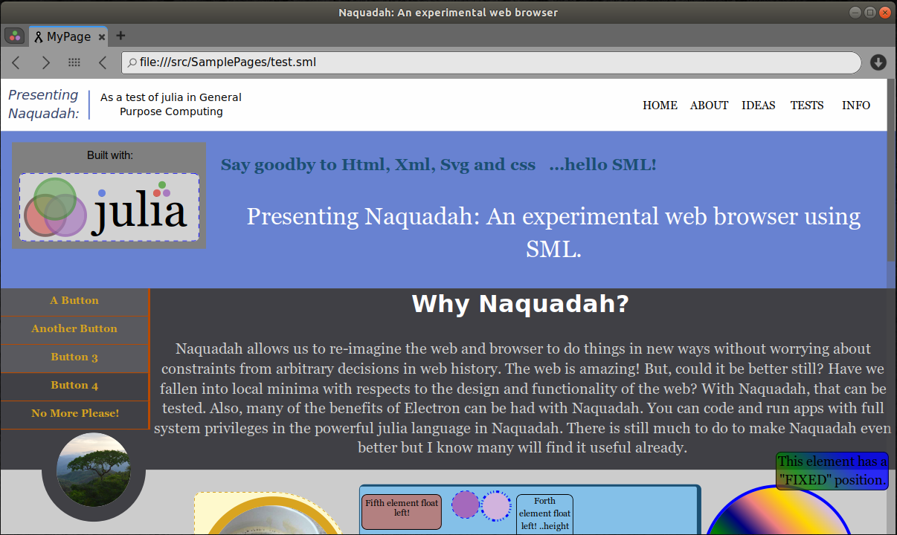
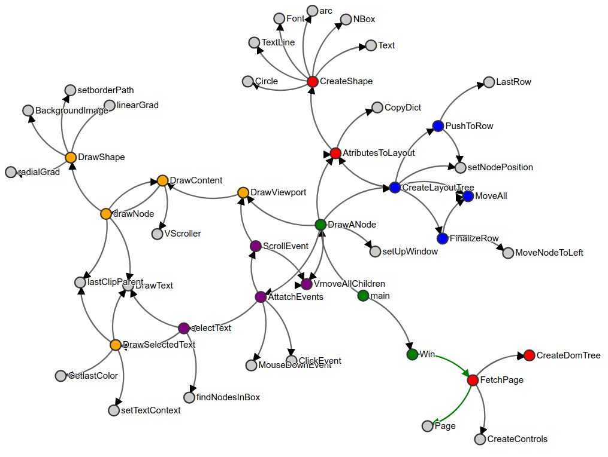

## [Overview and documentation of](https://github.com/TravisA9/NaquadahBrowser/tree/master/src) this project

---
#### [Leer en español](/Español.md)

## What is Naquadah?

**Short answer**: An experimental web browser that consumes **Scss**-like code instead of **HTML/SVG/CSS**

#### Why would we want that?

One of the principal experimental features of Naquadah is a consolidation of the many langauges into just one. To greatly reduce the complexity of both the browser and web design and development. This opens up new possibilities for the browser.

Take a look at a more recent image:

### Here are a few cool features of Naquadah:

* **Geometry as Nodes:** SVG is increasingly being mixed in with Html. The objective here is not to mix, but to completely integrate the features of SVG into our markup language. So far circles are set up to work as normal page elements but other common geometries will also soon be added.

* **Tabs, Search bar, etc. are Shadow DOM:**  This makes it possible to move or even completely redesign them. This should help ensure that the browser works with any graphics engine changes and even change the appearance and functionality where needed \(Ex. mobile devices\).

* **Classes, variables and templates:** Templates are often desirable to define structure (and its associated styles) that is repetitive within a web site. This can be done in Sml, an Scss-like language. By declaring a class in Sml you can apply styles to whole structures of elements. You can also create named variables and use them in your Sml.

* **julia:** Web browsers usually execute JavaScript. This browser executes julia

# Code overview: Warning, always changing!

 

### Take a look at the old version

travisashworth2007@gmail.com
